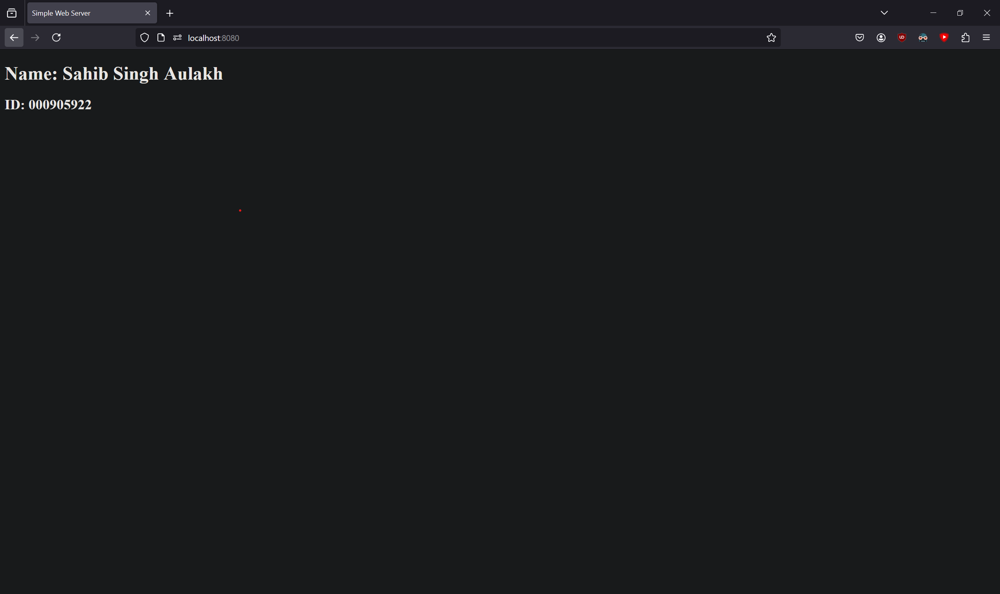
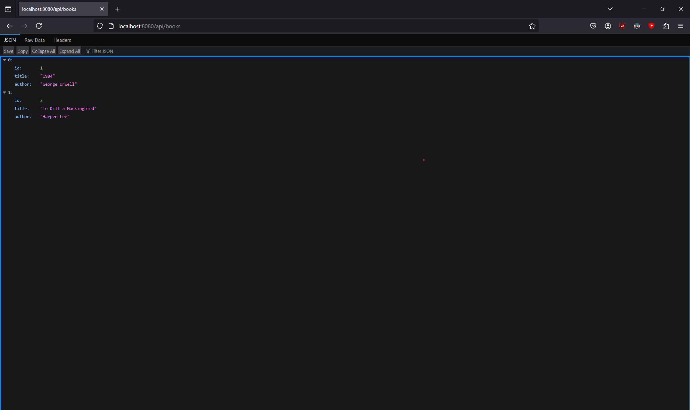
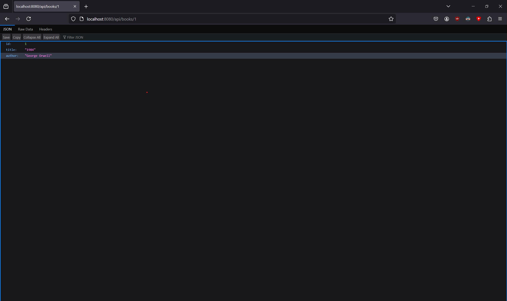

# Midterm

## Installation

Installing Docker on Windows is simple as long as you follow the Docker desktop installer. Install WSL before it because it is recommended in the Docker documentation.

## Challenge 1: Simple Web Server for Static Web Pages

### Instructions

1. Create the `index.html` File

    * Create a directory for your project name it what you like. In this case I am using `simple-web-server`.
    * Inside this directory, create a file named `index.html` with the following content:

        ```html
        <!DOCTYPE html>
        <html>
        <head>
        <title>Simple Web Server</title>
        </head>
        <body>
        <h1>Name: `${your name}`</h1>
        <h2>ID: `${your id}`</h2>
        </body>
        </html>
        ```

2. Create the `Dockerfile`

    * In the same directory, create a file named Dockerfile with the following content:

        ```dockerfile
        FROM nginx:latest

        COPY index.html /usr/share/nginx/html/

        EXPOSE 80
        ```

3. Build the Docker Image

    * Open your terminal, navigate to the project directory, and build the Docker image:

        ```shell
        docker build -t simple-web-server .
        ```

4. Run the Docker Container

    * Run the Docker container using the following command:

        ```shell
        docker run -d -p 8080:80 --name simple-web-server simple-web-server
        ```

5. Verify the Web Server

    * Open a web browser and navigate to `http://localhost:8080`. You should see the page with your name and student ID.

### Expected Outcomes

1. When you make a request to `http://localhost:8080/`, you will get a home page with your name and ID number.  
    

## Challenge 2: Creating a Dynamic Application

### Instructions

1. Set Up the Application

    * Create a directory for your project name it what you like. In this case I am using `dynamic-app`.
    * Inside this directory, create a subdirectory named `app`.

2. Create the Application Code
    * Inside the `app` directory, create a file named `server.js` with the following content:

        ```js
        const express = require('express');

        const app = express();
        const port = 3000;

        const books = [
        { id: 1, title: "1984", author: "George Orwell" },
        { id: 2, title: "To Kill a Mockingbird", author: "Harper Lee" }
        ];

        app.get('/api/books', (req, res) => {
        res.json(books);
        });

        app.get('/api/books/:id', (req, res) => {
        const book = books.find(b => b.id == req.params.id);
        if (book) {
            res.json(book);
        } else {
            res.status(404).send('Book not found');
        }
        });

        app.listen(port, () => {
        console.log(`Server running at http://localhost:${port}/`);
        });
        ```

3. Create `package.json`
    * In the `app` directory, create a `package.json` file with the following content:

        ```json
        {
        "name": "dynamic-app",
        "version": "1.0.0",
        "main": "server.js",
        "dependencies": {
            "express": "^4.17.1"
        },
        "scripts": {
            "start": "node server.js"
            }
        }
        ```

4. Create a `Dockerfile` for the Application
    * In the `app` directory, create a `Dockerfile` with the following content:

        ```dockerfile
        FROM node:14

        WORKDIR /usr/src/app

        COPY package*.json ./
        COPY server.js ./

        RUN npm install

        EXPOSE 3000

        CMD ["npm", "start"]
        ```

5. Set Up `nginx`

    * In the `dynamic-app` directory, create an `nginx` directory.
    Inside the `nginx` directory, create a file named `default.conf` with the following content:

        ```nginx
        server {
            listen 80;

            location / {
                proxy_pass http://app:3000;
                proxy_set_header Host $host;
                proxy_set_header X-Real-IP $remote_addr;
                proxy_set_header X-Forwarded-For $proxy_add_x_forwarded_for;
                proxy_set_header X-Forwarded-Proto $scheme;
            }
        }
        ```

6. Create a `Dockerfile` for `Nginx`

    * In the `nginx` directory, create a `dockerfile` with the following content:

        ```dockerfile
        FROM nginx:latest
        COPY default.conf /etc/nginx/conf.d/default.conf
        ```

7. Create a Docker Compose File

    * In the `dynamic-app` directory, create a `docker-compose.yml` file with the following content:

        ```yaml
        version: '3.8'

        services:
        app:
            build: ./app
            ports:
            - "3000:3000"
        nginx:
            build: ./nginx
            ports:
            - "8080:80"
            depends_on:
            - app
        ```

8. Build and Run the Application Using Docker Compose

    * In the `dynamic-app` directory, run the following command:

        ```shell
        docker-compose up --build
        ```

### Expected Outcomes

* When you make a request to `http://localhost:8080/api/books`, you will get a JSON message with all books.  
    

* When you make a request to `http://localhost:8080/api/books/1`, you will get a JSON message with just one book.  
    

## References

* [Docker Tutorial For Beginners](https://www.youtube.com/watch?v=gAkwW2tuIqE)

* [Docker Documentation](https://docs.docker.com/)
